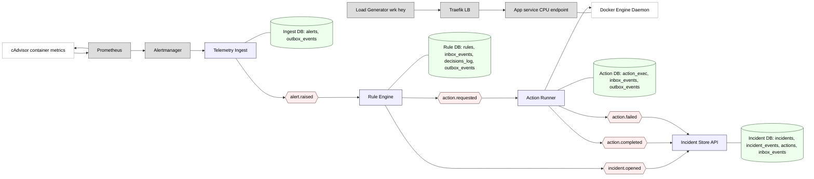

# EventPulse (минимальная хореография)

Диаграмма дополнена компонентами слева от Alertmanager: Docker, приложение, Traefik, cAdvisor, Prometheus. Компонент «Event Broker» убран; сами топики (узлы с фигурными скобками) представляют Kafka/NATS. Стрелка из Incident Store API в Kafka убрана — в минимальной версии Incident Store выступает как потребитель и источник истины, без публикации статусных событий. При желании можно добавить отдельный топик `incident.status` пунктиром.



## Компоненты (подробно)

- Load Generator
  - Инструмент нагрузки (wrk/hey/ab), бьёт по Traefik роуту `/work`.
  - Нужен для запуска сценария HighCPU/LowCPU.

- Traefik (LB)
  - Балансирует запросы между всеми контейнерами приложения с общим набором Docker-лейблов (`traefik.enable=true`, `service=app`).
  - Автодискавери новых реплик.

- App service (CPU endpoint)
  - Простой HTTP-эндпойнт, создающий CPU-нагрузку (например, 50–100 мс CPU на запрос).
  - Имеет HEALTHCHECK (желательно), чтобы Runner мог распознать readiness.

- Docker Engine / Daemon
  - Цель вызовов Action Runner: создать/запустить/остановить контейнеры (`service=app`).
  - Доступ через `/var/run/docker.sock` или TCP+TLS.

- cAdvisor
  - Собирает метрики контейнеров от Docker (CPU/Memory/IO).
  - Экспонирует для Prometheus.

- Prometheus
  - Скрэпит cAdvisor.
  - Правила: HighCPU (например, >50% avg за 2m) и LowCPU (<20% avg за 5m), агрегируя по лейблу сервиса (`service="app"`).

- Alertmanager
  - Отправляет webhook на Ingest при срабатывании и при резолве алерта.

- Telemetry Ingest
  - Принимает webhook Alertmanager, нормализует payload.
  - В одной транзакции пишет:
    - `alerts` — текущее состояние алерта (id, labels, first/last_seen, occurrences).
    - `outbox_events` — событие `alert.raised` к публикации.
  - Публикует `alert.raised` в топик A1 (после ACK брокера помечает как отправлен — если используете механизм ACK; в минимальном варианте можно просто «пушить» без журналирования).
  - База: Ingest DB — `alerts`, `outbox_events`.

- Rule Engine
  - Потребляет `alert.raised` (A1).
  - По правилам:
    - Эмитит `incident.opened` (I1) при HighCPU.
    - Эмитит `action.requested` (AR) — `scale_docker` до 2 реплик при HighCPU; до 1 при LowCPU/компенсации.
  - Дедупликация через `inbox_events` (идемпотентность).
  - Лог решений — `decisions_log`.
  - База: Rule DB — `rules`, `inbox_events`, `decisions_log`, `outbox_events`.

- Action Runner
  - Потребляет `action.requested` (AR).
  - Вызывает Docker API:
    - Scale-up: создаёт недостающие реплики (с одинаковыми Traefik-лейблами).
    - Scale-down: удаляет «лишние» реплики (например, самые новые).
  - Проверяет readiness (HEALTHCHECK или HTTP-проба). При успехе — `action.completed` (AC), при неуспехе/таймауте — `action.failed` (AF).
  - База: Action DB — `action_exec`, `inbox_events`, `outbox_events`.

- Incident Store API (минимальный sink)
  - Потребляет `incident.opened`, `action.completed`, `action.failed`.
  - Обновляет источник истины:
    - `incidents` (статусы: open → mitigating → resolved/failed).
    - `incident_events` (история).
    - `actions` (связка с инцидентом).
    - `inbox_events` (дедуп).
  - В этой минимальной версии НЕ публикует статусные события (стрелка в Kafka/топики убрана). Если понадобится — можно добавить топик `incident.status` пунктиром.

## Таблицы (минимальные)

- Ingest DB: `alerts`, `outbox_events`
- Rule DB: `rules`, `inbox_events`, `decisions_log`, `outbox_events`
- Incident DB: `incidents`, `incident_events`, `actions`, `inbox_events`
- Action DB: `action_exec`, `inbox_events`, `outbox_events`

## Последовательность действий (основной и компенсирующий пути)

Сценарий: автоскейл до 2 реплик при HighCPU и откат до 1 при сбое

1) Нагрузка и метрики
- LoadGen → Traefik → App: рост запросов → CPU растёт.
- Prometheus скрэпит cAdvisor; правило HighCPU держится `for: 2m`.

2) Алерт → Ingest
- Alertmanager шлёт webhook.
- Ingest пишет `alerts` + `outbox_events` (атомарно), публикует `alert.raised` в A1.

3) Решение правил
- Rule Engine получает `alert.raised`, проверяет текущие реплики (например, опрашивая Docker API или храня состояние в DB).
- Эмитит:
  - `incident.opened` (I1) — ссылка на alert_id.
  - `action.requested` (AR) — `scale_docker`, `desired_replicas=2`.

4) Исполнение действия
- Action Runner получает AR, сравнивает `current` vs `desired`.
- Если нужно, создаёт недостающие контейнеры, ждёт readiness.
- Успех → публикует `action.completed` (AC).
- Неуспех/таймаут → публикует `action.failed` (AF).

5) Учёт состояния
- Incident Store API потребляет I1/AC/AF и обновляет:
  - `incidents` (open → mitigating → resolved/failed).
  - `incident_events` (аудит).
  - `actions` (статус выполнения).

6) Компенсация (при AF или таймауте)
- Rule Engine на `action.failed` (AF) публикует `action.requested(ensure_replicas=1)` (AR).
- Action Runner выполняет конвергенцию: приводит число реплик к 1, чистит «зомби».
- Публикует `action.completed` (AC).
- Incident Store фиксирует итог: resolved (если стабильность достигнута) или failed (если нагрузка остаётся высокой).

7) Downscale при LowCPU (гистерезис)
- При `LowCPU` (например, <20% за 5m) Rule Engine публикует `action.requested(desired=1)`.
- Action Runner уменьшает до 1, AC → Incident Store = resolved.

Почему убрана стрелка Incident Store API → Kafka/топики
- В минимальной реализации Incident Store — терминальный потребитель и источник истины. Он не обязан публиковать статусные события; этого достаточно для демонстрации хореографии и базовых паттернов.
- Если потребуется уведомлять внешние системы, можно добавить отдельный топик `incident.status` и пунктирную стрелку (опционально).

Примечания по надёжности и простоте
- Идемпотентность: inbox в каждом потребителе; ключи `alert_id`, `incident_id`, `action_id`.
- Outbox: у производителей событий (Ingest, Rules, Action) для гарантии доставки.
- Анти-флаппинг: `for:` в алертах и `cooldown` в Rule Engine.
- Балансировка: Traefik автоматически видит новые реплики по Docker-лейблам.

## Инфраструктура окружения (готово сейчас)

В этом коммите добавлены:
- Go-проект с заготовками сервисов EventPulse (`cmd/ingest`, `cmd/rule-engine`, `cmd/action-runner`, `cmd/incident-api`). Они пока не реализованы — просто стартуют и ждут (TBD).
- Внешний стек для демонстрации алертов и вебхуков:
  - Traefik (Docker provider) — роут `GET /work` на сервис `app`.
  - `app` — простой Go-сервис, создающий CPU-нагрузку 50–100мс на запрос (`/work`) и `GET /healthz`.
  - cAdvisor — метрики контейнеров.
  - Prometheus — скрейпит cAdvisor, содержит правила HighCPU/LowCPU.
  - Alertmanager — шлёт вебхук на `webhook-debug` при срабатывании/резолве.
  - `webhook-debug` — Go-сервис, принимающий вебхук и логирующий payload.
  - Load Generator — Vegeta, генерирует запросы к Traefik (`/work`).

Структура файлов:
- `docker-compose.yml` — оркестрация всего стека.
- `cmd/app` — исходники CPU-приложения + Dockerfile.
- `cmd/webhook-debug` — исходники вебхука + Dockerfile.
- `monitoring/prometheus/{prometheus.yml,rules/cpu.yml}` — конфиг и правила алертов.
- `monitoring/alertmanager/alertmanager.yml` — маршрутизация алертов в вебхук.
- `traefik/` — (не требуется статический конфиг; Traefik настраивается через Docker-лейблы).

## Быстрый запуск

Требования: Docker Desktop (macOS), порты 80, 8081, 8080, 8082, 9090, 9093 свободны.

1) Собрать и поднять стек:
```
docker compose up --build -d
```

2) Проверка доступности:
- Traefik dashboard: http://localhost:8081
- App через Traefik: http://localhost/work, health: http://localhost/healthz
- cAdvisor: http://localhost:8082
- Prometheus: http://localhost:9090
- Alertmanager: http://localhost:9093
- Webhook-debug: http://localhost:8080

3) Нагрузка:
- В составе `docker-compose.yml` запустится Vegeta, который будет слать запросы на `/work`.
- При стабильной нагрузке правило HighCPU (>50% за 2m) сработает — смотрите Alerts в Prometheus/Alertmanager.
- Alertmanager будет отправлять вебхук на `webhook-debug` — payload отобразится в логах контейнера `webhook-debug`.

### Управление нагрузкой
- Теперь используется локальный Go-генератор (`loadgen`) вместо Vegeta — это избавляет от проблемы несовпадения платформ (amd64 vs arm64) на Apple Silicon.
- Параметры нагрузки задаются через переменные окружения сервиса `loadgen` в `docker-compose.yml`:
  - `TARGET_URL` — целевой URL (например, `http://traefik/work?ms=300&workers=2`).
  - `RATE` — запросов в секунду.
  - `CONCURRENCY` — максимальная параллельность запросов.
- Сам эндпойнт `/work` поддерживает параметры:
  - `ms` — длительность CPU-нагрузки на воркер (мс), по умолчанию ~100–300мс с вариацией.
  - `workers` — число параллельных горутин, имитирующих работу (по умолчанию 1).
- Можно управлять количеством используемых CPU в контейнере приложения через:
  - Переменную окружения `APP_GOMAXPROCS` (например, `2`).
  - Ограничение `cpus: "0.5"` в `docker-compose.yml` для контейнера `app` — помогает быстрее достигать высокую загрузку (в локальном Compose).

Останов:
```
docker compose down
```

## Замечания по метрикам CPU

Правила используют метрику `container_cpu_usage_seconds_total` от cAdvisor и фильтруют по Docker-лейблу `service=app`. Для корректной работы лейбл проставлен на контейнере приложения через `docker-compose.yml`.

Для визуализации процента загрузки используйте в Prometheus:

```
sum by (container_label_service) (
  rate(container_cpu_usage_seconds_total{container_label_service="app", image!=""}[2m])
)
```

Значение `1.0` соответствует полной загрузке одного CPU (ядра). Порог `0.5` — примерно 50% одного CPU.

## Apple Silicon (ARM64) и несовпадение платформ

Если видите предупреждение вида:
"The requested image's platform (linux/amd64) does not match the detected host platform (linux/arm64/v8)"

- Предпочтительный путь: собирать свои образы локально (как сделано для `app`, `webhook-debug`, `loadgen`) — Docker соберёт их под ARM64.
- Альтернатива: указать `platform: linux/arm64` для сервисов в Compose (если образ поддерживает мультиарх).
- Или включить эмуляцию (Rosetta/QEMU), но это медленнее и не рекомендуется для нагрузки.

## Дальнейшие шаги (EventPulse)
- Реализация Telemetry Ingest: прием вебхука Alertmanager, нормализация, запись в БД, публикация `alert.raised`.
- Реализация Rule Engine: потребление `alert.raised`, принятие решений, публикация `incident.opened` и `action.requested`.
- Реализация Action Runner: исполнение `scale_docker`, публикация `action.completed`/`action.failed`.
- Реализация Incident Store API: потребление I1/AC/AF, обновление состояния.