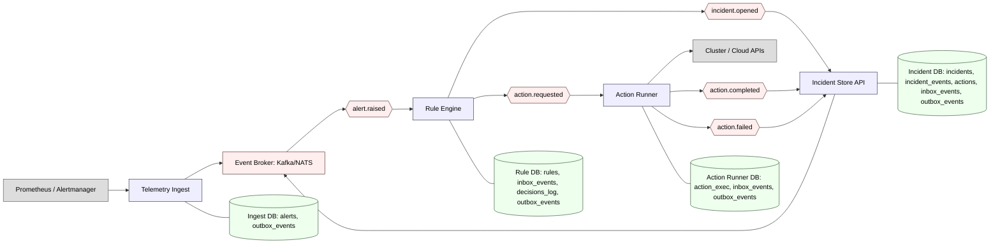

# EventPulse: архитектурная схема (хореография событий) — обновлённая без Notifications/ChatOps/OTel/Config

## Таблицы в БД (сводно)
- Ingest DB: `alerts`, `outbox_events`
- Rule DB: `rules`, `inbox_events`, `decisions_log`, `outbox_events`
- Incident DB: `incidents`, `incident_events`, `actions`, `inbox_events`, `outbox_events`
- Action Runner DB: `action_exec`, `inbox_events`, `outbox_events`