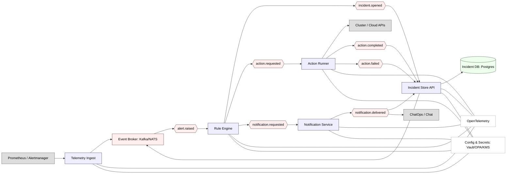

# EventPulse: архитектурная схема (хореография событий)

Ниже — схема компонентов, потоков событий и отмеченные базовые паттерны распределённой системы. Модель построена как чистая хореография: нет центрального оркестратора, все реакции — через события.

## Компоненты
- Telemetry Ingest
  - Принимает алерты из Prometheus/Alertmanager, нормализует, пишет в outbox-таблицу и публикует `alert.raised`.
- Rule Engine
  - Подписывается на `alert.raised`. По правилам решает: открыть инцидент (`incident.opened`), запросить действие (`action.requested`), отправить уведомление (`notification.requested`).
- Action Runner
  - Подписывается на `action.requested`. Выполняет runbook/скрипт с таймаутами/ретраями/схемой Circuit Breaker. Публикует `action.completed` или `action.failed`.
- Incident Store API
  - Подписывается на `incident.opened`, `action.completed`, `action.failed`, `notification.delivered`. Обновляет состояние в БД. Имеет REST/gRPC. При изменениях использует transactional outbox и публикует статусные события.
- Notification Service
  - Подписывается на `notification.requested`, доставляет уведомления (Slack/Email/Webhooks), публикует `notification.delivered`.
- Event Broker
  - Темы: `alert.raised`, `incident.opened`, `action.requested`, `action.completed`, `action.failed`, `notification.requested`, `notification.delivered`.
- Observability
  - OpenTelemetry для трейсинга/метрик/логов, корреляция по `trace_id` и `incident_id`.
- Config & Secrets
  - Централизованная конфигурация, хранение секретов (Vault/KMS), политики (OPA).

## Базовые паттерны, отражённые на схеме
- Хореография (Event-driven): все переходы инициируются событиями, нет центрального оркестратора.
- Transactional Outbox + CDC:
  - Ingest и Incident Store API при записи в БД публикуют события атомарно.
- Идемпотентность обработчиков:
  - Rule Engine, Notification Service и Incident Store API используют ключи `alert_id`/`incident_id` для безопасных повторов.
- Circuit Breaker + Таймауты + Retry (с джиттером):
  - На вызовах внешних систем из Action Runner.
- Bulkhead (изоляция ресурсов):
  - Раздельные пулы для Rule Engine, Action Runner, Notification Service.
- Backpressure:
  - Очереди брокера ограничивают скорость потребления; у сервисов — контролируемая конкуренция.
- Разделение данных:
  - Хранилище инцидентов принадлежит Incident Store API; остальные — статусы через события.
- Наблюдаемость:
  - Корреляция по событиям и трейсинг по пути Alert → Incident → Action → Notification.
- Health checks:
  - Readiness/Liveness для каждого сервиса.
- Безопасность:
  - mTLS между сервисами, авторизация API, секрет-менеджмент.

## Минимальные темы и ключи идемпотентности
- Темы:
  - `alert.raised`, `incident.opened`, `action.requested`, `action.completed`, `action.failed`, `notification.requested`, `notification.delivered`.
- Ключи:
  - `alert_id`, `incident_id`, `action_id` (композиция: источник + ts + правило).
  - Deduplication по ключу в Rule Engine и Notification Service.

## Потоки и статусы инцидента (пример)
- Статусы: `open` → `mitigating` → `resolved` / `failed`.
- Переходы:
  - `incident.opened` → `open`
  - `action.requested` → `mitigating`
  - `action.completed` → `resolved`
  - `action.failed` → `failed` (или компенсационные действия по правилам)

Эта схема покрывает базовые паттерны, оставаясь компактной и чисто событийно-хореографической.

Сценарий: авто‑митigation по алерту «CPU > 90%»

Источник алерта
Prometheus/Alertmanager фиксирует правило cpu_high на сервисе svc-a и отправляет алерт в Ingest.
Payload: alert_id, source=prometheus, severity=warning, labels: service=svc-a, threshold=90%, ts.
Приём и публикация
Ingest валидирует, нормализует, пишет запись в свой журнал/outbox.
Публикует событие alert.raised в Broker с ключом alert_id и trace_id.
Принятие решения правилами
Rule Engine потребляет alert.raised.
По правилам:
Открыть инцидент: incident.opened (incident_id, service=svc-a, severity=warning).
Запросить действие: action.requested (action_id, type=scale_up, target=svc-a, delta=+1).
Запросить уведомление: notification.requested (incident_id, channel=slack, template=incident_opened).
Все эмитты идемпотентны по ключам alert_id/incident_id/action_id.
Учет состояния инцидента
Incident Store API потребляет incident.opened и обновляет IncidentDB: статус open, связка alert_id ↔ incident_id.
Публикует статусное событие (при необходимости) через свой outbox.
Исполнение действия
Action Runner потребляет action.requested.
Выполняет runbook: вызов Cloud API для масштабирования svc-a с Circuit Breaker, таймаутами и ретраями.
При успехе публикует action.completed; при неуспехе — action.failed.
Завершение/обновление инцидента
Incident Store API потребляет action.completed:
Обновляет статус инцидента: resolved.
Пишет историю: кто, когда, что изменил.
Публикует статусное событие (опционально).
Если было action.failed:
Статус: failed или mitigating (в зависимости от политики).
Может инициировать компенсацию/альтернативное действие через Rule Engine (например, перезапуск, откат скейла).
Уведомления
Notification Service потребляет notification.requested:
Формирует сообщение, отправляет в Slack/Email/Webhook.
Публикует notification.delivered.
Incident Store API потребляет notification.delivered:
Логирует факт доставки, обновляет поле last_notified_at.
Наблюдаемость и конфигурация
Все сервисы пишут трейсинг/метрики/логи в OpenTelemetry; корреляция по trace_id, alert_id, incident_id.
Конфигурации/секреты берутся из централизованного хранилища (Vault/OPA/KMS).
Пример цепочки событий

alert.raised(alert_id=a123, service=svc-a)
incident.opened(incident_id=i456, alert_id=a123)
action.requested(action_id=act789, type=scale_up, target=svc-a)
action.completed(action_id=act789)
notification.requested(incident_id=i456, channel=slack)
notification.delivered(incident_id=i456)
Аварийный путь (сбої при действии)

alert.raised → incident.opened → action.requested
Cloud API недоступен → ретраи истекают → action.failed
Incident Store API помечает инцидент как failed/mitigating
Rule Engine по политике инициирует альтернативный action.requested (например, перезапуск, снижение нагрузки) и повторное notification.requested
Успешное альтернативное действие → action.completed → инцидент resolved; иначе остаётся failed с периодическими нотификациями.
Идемпотентность и дедупликация

Повторы alert.raised не создают второй инцидент — Rule Engine проверяет наличие i456.
Повторные notification.requested с тем же incident_id и шаблоном не ведут к двойной отправке — Notification Service фиксирует отправку по ключу.
Action Runner не выполняет один и тот же action_id дважды — хранит завершённые/в процессе action_id.